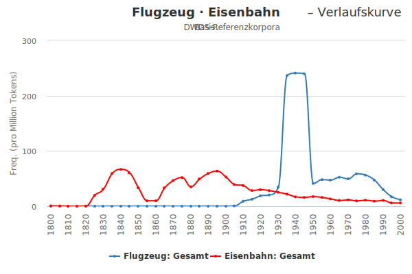

layout: true
  
<div class="my-header"></div>

<div class="my-footer">
  <table>
    <tr>
      <td>DWDS &ndash; Digitales Wörterbuch der deutschen Sprache</td>
      <td style="text-align:right"><a href="https://www.dwds.de">www.dwds.de</a></td>
    </tr>
  </table>
</div>

---

class: title-slide

# DWDS &ndash; Digitales Wörterbuch der deutschen Sprache  
## Mittels Computerlinguistik zum Wörterbuch der Zukunft

| Frank Wiegand   | Kay-Michael Würzner |
|:---------------:|:-------------------:|
| [wiegand@bbaw.de](mailto:wiegand@bbaw.de) | [wuerzner@bbaw.de](mailto:wuerzner@bbaw.de) |

---

# Überblick


---

# Was ist Computerlinguistik?

- Teildisziplin der **Sprachwissenschaft**
    + Philologie: Beschäftigung mit den sprachlichen Zeugnissen **einer** Sprache/Sprachfamilie
        * *Germanistik*, *Anglistik*, *Romanistik* etc.
    + Linguistik: Beschäftigung mit **sprachübergreifenden** Phänomenen
        * Ebenen: *Phonologie*, *Morphologie*, *Syntax*, *Semantik* etc.
        * Anwendungsfelder: *Sprachverarbeitung*, *Spracherwerb*, *Sprachstörungen* etc.
- <span style="font-variant:small-caps;">Ferdinand de Saussure</span> (1857&ndash;1913)
    + Begründer des **sprachwissenschaftlichen Strukturalismus**
        * *Langage*: das (biologische) Sprachvermögen
        * *Langue*: Sprache als ein abstraktes System von Regeln
        * *Parole*: Sprechen, konkete Sprachverwendung

---

# Was ist Computerlinguistik?

- Zwei **Teildisziplinen**
    + *Natural Language Processing* (NLP, etwa Linguistische Datenverarbeitung)
        * Verfahren zur automatischen **Analyse** und **Generierung** von Sprache auf allen Ebenen
        * wichtiger Bestandteil unseres medialen Umfelds
    + *Computational Linguistics* (CL, etwa berechenbare, rechenbetonte Sprachwissenschaft)
        * theoretische Beschreibungen der formalen Grundlagen von Sprache
        * Berechenbarkeit, Beweisbarkeit, Modellierung
- <span style="font-variant:small-caps;">Noam Chomsky</span> (&#x2A;1928)
    + Begründer der **generativen Linguistik**
        * *Universalgrammatik*: alle Sprachen folgen gemeinsamen, angeborenen Prinzipien
        * *Tiefen- vs. Oberflächenstruktur*: unterschiedliche Realisierungen gleicher Bedeutungen basieren auf einer gemeinsamen abstrakten Struktur

---

# Das DWDS

- Institution: Berlin-Brandenburgische Akademie der Wissenschaften (BBAW)
- Langzeitvorhaben
- ca. 15 Mitarbeiter/innen
- (nur!) online: [https://www.dwds.de](https://www.dwds.de) (seit 2004)
- Wörterbücher, Textsammlungen (Korpora), Tools

---

# Vogelperspektive

---

# DWDS: Formteil

http://zwei.dwds.de/wb/Leiter

- Zusammenfassung der **formalen Eigenschaften** eines Wortes:
    + Wortart
    + Eck- (Substantive), Stamm- (Verben )und Komparationsformen (Adjektive)
    + Aussprache
    + Worttrennung (Zeilenende)
    + Wortzerlegung, -bildung
- teils manuell, teils automatisch erhoben

---

# NLP: morphologische Analyse

- Aufgabe
    + Bestimmung der **möglichen** Wortarten eines Wortes
      ```
      grünen ↦ {Verb, Adjektiv}
      Kai    ↦ {Substantiv, Eigenname}
      ```
    + Abbildung auf eine kanonische **Grundform**
      ```
      grünen ↦ grün
      Kais   ↦ Kai
      ```
    + Identifikation der beteiligten Wortbildungsprozesse
      ```
      Grünspan ↦ grün<A>#Span<N>
      verirren ↦ ver<p>+irren<V>
      ```

---

# NLP: morphologische Analyse

- Rezept `Finite State Morphology`:
    + Man nehme
        * eine **große** Liste einfacher Wörter
        * deren **morphosyntaktische** Eigenschaften
        * Vor- und Nachsilben,
    + packe dies in einen **endlichen Automaten** und
    + bilde dessen **kleenesche Hülle**
- <span style="font-variant:small-caps;">Stephen Cole Kleene</span> (1909&ndash;1994)
    + Mitbegründer der theoretischen Informatik
        * formale Sprachen
        * **reguläre Ausdrücke**

---

# NLP: morphologische Analyse

- Illustration
    + Lexikon `{schön<A>,Geist<N>}`
    + Vorsilben `{un<p>,ur<p>}`
    + Nachsilben `{heit<N>,lich<A>}`

---

# NLP: morphologische Analyse

- Zahlen
    + *n* Lexikoneinträge
    + *x* Vorsilben
    + *y* Nachsilben
    + *z* Regeln
    + *i* Zustände
- klassischer **regelbasierter** Ansatz,
    + manuell gepflegte **Daten** als Operanden und
    + manuell erstellte **Regeln** zu deren Kombination
- Grundlage bzw. Bestandteil der meisten Sprachverarbeitungssysteme

http://zwei.dwds.de/?q=Dampfschifffahrtsgesellschaftskapit%C3%A4n&from=wb
http://zwei.dwds.de/?q=Dampfschifffahrtsgesellschaftskapit%C3%A4nsm%C3%BCtze&from=wb

---

# NLP: Worttrennung

- Aufgabe
    + Bestimmung aller möglichen Stellen für die Worttrennung **am Zeilenende**
      ```
      Elektrik ↦ Elek·t·rik ↦ {Elek-trik,Elekt-rik}
      ```
    + nicht zu verwechseln mit **Silbentrennung**
      ```
      Elektrik ↦ E·lek·trik ↦ {E-lek-trik}
      ```
    + Herausforderung durch **Lehnwörter**
      ```
      Ale ↦ Ale ↦ {Ale}
      ```

---

# NLP: Worttrennung

- Rezept `Sequenzklassifizierung`
    + Man nehme
        * eine **sehr große** Liste **manuell annotierter** Daten und
        * einen **Trainingsalgorithmus**,
    + induziere ein **statistisches Modell**,
    + und evaluiere dessen Qualität anhand von **Evaluationsdaten**
- <span style="font-variant:small-caps;">Andrei Andrejewitsch Markow</span> (1856&ndash;1922)
    + wesentliche Beiträge zur **Wahrscheinlichkeitstheorie**
    + arbeitete früh (1913) mit Häufigkeitsanalysen in Textsammlungen
    + formulierten die Grundlagen sog. *Hidden Markov Models*

---

# NLP: Wortrennung

- Illustration

---

# NLP: Wortrennung

- Evaluation
    * ...
- klassischer **statistischer Ansatz**,
    + manuell gepflegte **Daten** als Operanden und
    + **Induktionsverfahren** zu deren Modellierung
- Grundlage heute omnipräsenter Verfahren des *Deep Learning*
- Einsatz in allen Domänen der Sprachverarbeitung

---

- Bedeutungen: Handarbeit, Lesarten, Belege, Kollokationen
- Etymologie (HA)
- Thesaurus (HA)

---

# Überblick

## Demo

- Typische Verbindungen:
    - Korpora: Annotation, Quellen
    - syntaktische Analyse
    - Kollokationen
    - distributionelle Semantik (Profilardy)
- Verwendungsbeispiele
- Wortverlaufskurven

---

# Überblick

## Aufgabenteil

---

# Formteil

---

# Wortverlaufskurven



---

# Wortverlaufskurven


