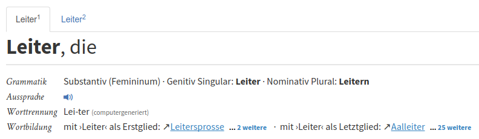
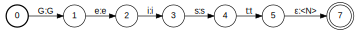
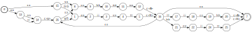

layout: true
  
<div class="my-header"></div>

<div class="my-footer">
  <table>
    <tr>
      <td>DWDS &ndash; Digitales Wörterbuch der deutschen Sprache</td>
      <td style="text-align:right"><a href="https://www.dwds.de">www.dwds.de</a></td>
    </tr>
  </table>
</div>

---

class: title-slide

# DWDS &ndash; Digitales Wörterbuch der deutschen Sprache  
## Mittels Computerlinguistik zum Wörterbuch der Zukunft

| Frank Wiegand   | Kay-Michael Würzner |
|:---------------:|:-------------------:|
| [wiegand@bbaw.de](mailto:wiegand@bbaw.de) | [wuerzner@bbaw.de](mailto:wuerzner@bbaw.de) |

---

# Überblick


---

# Was ist Computerlinguistik?

- Teildisziplin der **Sprachwissenschaft**
    + Philologie: Beschäftigung mit den sprachlichen Zeugnissen **einer** Sprache/Sprachfamilie
        * *Germanistik*, *Anglistik*, *Romanistik* etc.
    + Linguistik: Beschäftigung mit **sprachübergreifenden** Phänomenen
        * Ebenen: *Phonologie*, *Morphologie*, *Syntax*, *Semantik* etc.
        * Anwendungsfelder: *Sprachverarbeitung*, *Spracherwerb*, *Sprachstörungen* etc.
- <span style="font-variant:small-caps;">Ferdinand de Saussure</span> (1857&ndash;1913)
    + Begründer des **sprachwissenschaftlichen Strukturalismus**
        * *Langage*: das (biologische) Sprachvermögen
        * *Langue*: Sprache als ein abstraktes System von Regeln
        * *Parole*: Sprechen, konkete Sprachverwendung

---

# Was ist Computerlinguistik?

- Zwei **Teildisziplinen**
    + *Natural Language Processing* (NLP, etwa Linguistische Datenverarbeitung)
        * Verfahren zur automatischen **Analyse** und **Generierung** von Sprache auf allen Ebenen
        * wichtiger Bestandteil unseres medialen Umfelds
    + *Computational Linguistics* (CL, etwa berechenbare, rechenbetonte Sprachwissenschaft)
        * theoretische Beschreibungen der formalen Grundlagen von Sprache
        * Berechenbarkeit, Beweisbarkeit, Modellierung
- <span style="font-variant:small-caps;">Noam Chomsky</span> (&#x2A;1928)
    + Begründer der **generativen Linguistik**
        * *Universalgrammatik*: alle Sprachen folgen gemeinsamen, angeborenen Prinzipien
        * *Tiefen- vs. Oberflächenstruktur*: unterschiedliche Realisierungen gleicher Bedeutungen basieren auf einer gemeinsamen abstrakten Struktur

---

# Computerlinguistik im Alltag

.center[]

---

# Computerlinguistik im Alltag

<table>
  <tr>
    <td></td>
    <td></td>
  </tr>
</table>

---

# Computerlinguistik im Alltag

.center[]

---

# Computerlinguistik im Alltag

.center[]


---

# Computerlinguistik im Alltag

.center[]

---

# Das DWDS

- Institution: Berlin-Brandenburgische Akademie der Wissenschaften (BBAW)
- Langzeitvorhaben
- ca. 15 Mitarbeiter/innen
- Wörterbücher, Textsammlungen (Korpora), Tools
- ca. 465 000 Wörterbucheinträge
- ca. 13 Milliarden Textbelege aus über vier Jahrhunderten


- (nur!) online: [https://www.dwds.de](https://www.dwds.de) (seit 2004)

---

# Lexikografische Arbeit

> In keiner Sprache kann man sich so schwer verständigen wie in der Sprache.  
*(Karl Kraus, österr. Schriftsteller, 1874&ndash;1936)*

+ (oft mühevolle) Handarbeit
+ viel Recherche:
    - in anderen Wörterbüchern
    - in Bibliotheken
    - im Internet
    - in Textsammlungen
    - ...
+ Teamsitzungen zur Absprache und Nachfrage

---

# Lexikografische Arbeit

+ *Deutsches Wörterbuch* (DWB), 1838&ndash;1961
    - von <span style="font-variant:small-caps;">Jacob</span> und <span style="font-variant:small-caps;">Wilhelm Grimm</span>
        * Gründungsväter der Germanistik
        * Herausgeber der weltberühmten *Kinder- und Hausmärchen*
    - das größte und umfassendste Wörterbuch zur deutschen Sprache
    - Belegwörterbuch zur Herkunft und zum Gebrauch jedes deutschen Wortes
    - 32 Bände, ca. 320&#x202f;000 Stichwörter, ca. 600&#x202f;000 Belege
    - konsequente Kleinschreibung

---

# Deutsches Wörterbuch (DWB)

.center[]

---

# DWDS: Formteil

.center[]

- Zusammenfassung der **formalen Eigenschaften** eines Wortes
- teils manuell, teils automatisch erhoben

---

count:false

# DWDS: Formteil

.center[]

- Zusammenfassung der **formalen Eigenschaften** eines Wortes
- teils manuell, teils automatisch erhoben

---

# DWDS: Formteil

+ Wortart (Substantiv, Verb, Adjektiv, ...)
    + inklusive Eck- und Stammformen; Komparationsangaben
+ Schreibungen
    * alles zulässig: **Delfin**, **Delphin**
    * neue Rechtschreibung: **Ablass**, ~~Ablaß~~
    * war schon immer falsch: **E-Mail**, ~~Email~~
+ weitere Informationen
    * **die** E-Mail, **das** E-Mail
.diasys[süddeutsch, österreichisch, schweizerisch]
    * **das** Virus, **der** Virus
.diasys[umgangssprachlich]
    * **Ferien**
.diasys[wird nur im Plural verwendet]

---

# DWDS: Formteil

+ Homographie
    - gleich geschriebene Wörter
    - verschieden nach: Herkunft, Formen, Genus, Aussprache, Zusammensetzung
    - Beispiele:
        + **Bug**: Vorderteil eines Schiffes, (Software)Fehler
        + **Band**: Pl. Bänder/Bande, Bände, Bands
        + **Bank**: Pl. Bänke, Banken
        + **sein**: Pronomen, Verb
        + **Dichtung**: von *dicht*, von *(er)dichten*
        + **Hut**: der, die
        + **Wachstube**: *Wach* + *Stube*, *Wachs* + *Tube*
+ Aussprache und Worttrennung
+ Wortzerlegung, Wortbildung

---

# NLP: morphologische Analyse

- Aufgabe
    + Bestimmung der **möglichen** Wortarten eines Wortes
      ```
      grünen ↦ {Verb, Adjektiv}
      Müller ↦ {Substantiv, Eigenname}
      ```
    + Abbildung auf eine kanonische **Grundform**
      ```
      grünen  ↦ grün
      Müllers ↦ Kai
      ```
    + Identifikation der beteiligten Wortbildungsprozesse
      ```
      Grünspan ↦ grün<A>#Span<N>
      verirren ↦ ver<p>+irren<V>
      ```

---

# NLP: morphologische Analyse

- Rezept `Finite State Morphology`:
    + Man nehme
        * eine **große** Liste einfacher Wörter
        * deren **morphosyntaktische** Eigenschaften
        * Vor- und Nachsilben,
    + packe dies in einen **endlichen Automaten** und
    + bilde dessen **Kleenesche Hülle**
- <span style="font-variant:small-caps;">Stephen Cole Kleene</span> (1909&ndash;1994)
    + Mitbegründer der Theoretischen Informatik
        * formale Sprachen
        * **Reguläre Ausdrücke**

---

# NLP: morphologische Analyse

- Illustration
    + Lexikon `{schön<A>,Geist<N>}`
    + Vorsilben `{un<p>,ur<p>}`
    + Nachsilben `{heit<N>,lich<A>}`

.center[.img-orig[]]

---

count: false

# NLP: morphologische Analyse

- Illustration
    + Lexikon `{schön<A>,Geist<N>}`
    + Vorsilben `{un<p>,ur<p>}`
    + Nachsilben `{heit<N>,lich<A>}`

.center[.img-orig[]]

---

count: false

# NLP: morphologische Analyse

- Illustration
    + Lexikon `{schön<A>,Geist<N>}`
    + Vorsilben `{un<p>,ur<p>}`
    + Nachsilben `{heit<N>,lich<A>}`

<center></center>

---

count: false

# NLP: morphologische Analyse

- Illustration
    + Lexikon `{schön<A>,Geist<N>}`
    + Vorsilben `{un<p>,ur<p>}`
    + Nachsilben `{heit<N>,lich<A>}`

<center></center>

---

count: false

# NLP: morphologische Analyse

- Illustration
    + Lexikon `{schön<A>,Geist<N>}`
    + Vorsilben `{un<p>,ur<p>}`
    + Nachsilben `{heit<N>,lich<A>}`

<center></center>

---

count: false

# NLP: morphologische Analyse

- Illustration
    + Lexikon `{schön<A>,Geist<N>}`
    + Vorsilben `{un<p>,ur<p>}`
    + Nachsilben `{heit<N>,lich<A>}`

<center></center>

---

# NLP: morphologische Analyse

- Zahlen
    + *n* Lexikoneinträge
    + *x* Vorsilben
    + *y* Nachsilben
    + *z* Regeln
    + *i* Zustände
- klassischer **regelbasierter** Ansatz,
    + manuell gepflegte **Daten** als Operanden und
    + manuell erstellte **Regeln** zu deren Kombination
- Bestandteil der meisten Sprachverarbeitungssysteme
- Wörterbuch unendlicher Größe:
    - [Dampfschifffahrtsgesellschaftskapitän](https://www.dwds.de/?q=Dampfschifffahrtsgesellschaftskapit%C3%A4n)
    - [Dampfschifffahrtsgesellschaftskapitänsmütze](https://www.dwds.de/?q=Dampfschifffahrtsgesellschaftskapit%C3%A4nsm%C3%BCtze)

---

# NLP: Worttrennung

- Aufgabe
    + Bestimmung aller möglichen Stellen für die Worttrennung **am Zeilenende**
      ```
      Elektrik ↦ Elek·t·rik ↦ {Elek-trik,Elekt-rik}
      ```
    + nicht zu verwechseln mit **Silbentrennung**
      ```
      Elektrik ↦ E·lek·trik ↦ {E-lek-trik}
      ```
    + Herausforderung durch **Lehnwörter**
      ```
      Software ↦ Soft·ware ↦ {Soft-ware}
      ```

---

# NLP: Worttrennung

- Rezept `Sequenzklassifizierung`
    + Man nehme
        * eine **sehr große** Liste **manuell annotierter** Daten und
        * einen **Trainingsalgorithmus**,
    + modelliere eine **`n:n`-Beziehung** zwischen Eingabe und Ausgabe,
        * jedes Eingabelement (Buchstabe) wird auf eine Klasse abgebildet
    + induziere ein **statistisches Modell**,
    + und evaluiere dessen Qualität anhand von **Evaluationsdaten**
- <span style="font-variant:small-caps;">Andrei Andrejewitsch Markow</span> (1856&ndash;1922)
    + wesentliche Beiträge zur **Wahrscheinlichkeitstheorie**
    + arbeitete früh (1913) mit Häufigkeitsanalysen in Textsammlungen
    + formulierten die Grundlagen sog. *Hidden Markov Models*

---

# NLP: Wortrennung

- Illustration
    + Daten
        * http://de.wiktionary.org
        * Wortrennungsangaben für > 250 000 deutsche Wörter
        * `Elektrik ↦ Elek·t·rik`
    + Kodierung `\(f: \Sigma\rightarrow\mathbb{B}\)` 
      $$
      f(x) = \begin{cases} 1 & x\,\text{gefolgt von Trennstelle} \\\\
      0 & \, \text{sonst}\end{cases}
      $$ 
      ```
      E l e k t r i k
      0 0 0 1 1 0 0 0
      ```
    + Training
        * Zählen von Sequenzen aus Eingabe-Ausgabe-Paaren unter der Markov-Annahme
        * Berechnung einer Wahrscheinlichkeitsverteilung
        * Repräsentation als statistisches Modell (HMM, CRF, neuronales Netz)

---

# NLP: Wortrennung

- Zusammenhang zu Morphologie!
    ```
    v e r i f i z i e r e n
    0 1 0 1 0 1 0 0 1 0 0 0
    v e r i r r e n
    0 0 1 0 1 0 0 0
    ```
- klassischer Ansatz: **überwachtes Lernen**,
    + manuell gepflegte **Daten** als Operanden und
    + **Induktionsverfahren** zu deren Modellierung
    + Grundlage von *Deep Learning* (**tiefe** neuronale Netze)
    - Einsatz auch außerhalb der Sprachverarbeitung
        + personalisierte Werbung
        + Kundenprofilierung etc.
    - Motivation für „Datensammelwut“

---

# Lexikografische Arbeit

+ Wortschatz der deutschen Sprache im Auge behalten
+ das eigene Wörterbuch kennen


1. neue Wörterbuchartikel schreiben: **Brexit**, **posten**
2. bestehende Artikel ergänzen:
    - neue Bedeutungen: **Maus**, **Ampel**
    - Anpassung an gesellschaftlichen Wandel: **Ehe**, **Eskimo**, **Gutmensch**
    - Artikel erweitern (weil bislang nur minimal)
3. bestehende Artikel überarbeiten:
    - Bedeutungswandel: **klicken**
    - Rechtschreibreform: ~~Ketschup~~, **Co-Trainer**

---

# DWDS: Bedeutungsteil

- (Unter)Bedeutungen eines Wortes:
    + **scharf**: schneidend, spitz, stark reizend, genau, deutlich, streng, ...
    + **Läufer**: jmd. der läuft, Teppich, Schachfigur, ...
    + **Birne**: Frucht, Baum, Glühlampe, Kopf
- Markierungen:
    + 
.diasys[bildlich] den Teufel an die Wand **malen**
    + 
.diasys[salopp, abwertend] jmdn. nicht **riechen** können
    + 
.diasys[vertraulich] altes **Haus**!
    + 
.diasys[gehoben, veraltend] jemanden einer Tat **zeihen** *(= bezichtigen)*
    + 
.diasys[Medizin] **Exazerbation:** Verschlimmerung, zeitweise Steigerung, Wiederaufleben einer Krankheit
    + 
.diasys[Schülersprache, landschaftlich] **Giftzettel:** Schulzeugnis

---

# DWDS: Bedeutungsteil

- (konstruierte) Beispiele:
    + die allgemeinbildende, berufsbildende, zehnklassige **Schule**
- Belege aus Textsammlungen:
    + „Urlaub in der eigenen Stadt ist nicht traurig, sondern **trendy**, und das schon seit einer ganzen Weile.“ *[Welt am Sonntag, 25.09.2016, Nr. 39]*
- Konstruktionsmuster:
    + etwas **gilt**
    + etwas **gelten** lassen
    + etwas **geltend** machen
    + es **gilt** etwas (zu tun)
- Kollokationen (= Stellung, Anordnung):
    + *mit Akkusativobjekt:* **Drogen** beschlagnahmen, sicherstellen
    + *mit vergleichender Wortgruppe:* **Drogen** wie Kokain, Ecstasy, Heroin

---

# Etymologie

- altgriechisch: *ἐτυμολογία (etymología)*
    + *ἔτυμος (étymos):* „wahr, echt, wirklich“
    + *λόγος (lógos):* „Wort“
- Wissenschaft von der Entstehung und geschichtlichen Veränderung einzelner Wörter 
- im DWDS mit ca. 25 000 Einträgen:
    + <span style="font-variant:small-caps;">Wolfgang Pfeiffer</span> (&#x2A;1922) &ndash; *Etymologisches Wörterbuch des Deutschen*

---

# Etymologie &ndash; Beispiele

.smaller[**Fake News:** Übernahme von gleichbedeutend *fake news* (amerik.-engl.)]

.smaller[**Eskimo:** Genaue Herkunft unsicher; wohl über **eskimoda**<sub>en</sub> oder **esquimau**<sub>frz</sub> aus einer indigenen nordostamerikanischen Algonkin-Sprache (Innu-aimun bzw. Montagnais), vermutlich mit einer ursprünglichen Bedeutung ‘Schneeschuh-Knüpfer’. Eine zunächst angenommene ursprüngliche Bedeutung ‘Esser von rohem Fleisch’ gilt als widerlegt, war aber der Grund, die Bezeichnung **Eskimo** als abwertend einzuschätzen.]

.smaller[**Maulwurf:** Der Name hat mehrfach volksetymologische Umdeutungen erfahren. Die älteste Bezeugung ahd. (8. Jh.), mhd. *mūwerf*, ahd. *mūwerfo* (11. Jh.) enthält in ihrem ersten Glied ein zu aengl. *mūga*, *mūha*, *mūwa* ‘Kornhaufen’, engl. *mow* ‘Heu-, Kornhaufen’, anord. *mūgi*, *mūgr* ‘Menge, Haufen’, mhd. *mocke* ‘Klumpen, Brocken’ gehörendes Substantiv, das vielleicht mit griech. *mýkōn* (*μύκων*) ‘(Korn)haufen’ verwandt ist ...]

---

# Etymologie &ndash; Aufgaben

+ Bestimme die Herkunft eines der folgenden Wörter:
    + *Ampel*
    + *Brille*
    + *Hängematte*
    + *heulen*
    + *Krawatte*
    + *Laune*
    + *Muckefuck*
    + *Teddy*

---

# Thesaurus

- altgriechisch:
  + *θησαυρός (thesaurós)* → „Schatz, Schatzhaus“
  + später lateinisch *thesaurus* → *Tresor*
- Wortnetz: listet systematisch Wörter
    + gleichbedeutend, ähnlich (Synonyme)
    + Oberbegriffe (Hyperonyme)
    + Unterbegriffe (Hyponyme)
    + thematisch verwandt (Assoziationen)
    + Gegenwörter (Antonyme)
- im DWDS:
    + [OpenThesaurus](http://www.openthesaurus.de) mit ca. 160 000 Einträgen
    + GermaNet

---

# Thesaurus

- Synonyme:
    * **Kreuz:**
        + Bürde, Crux, Fron, Joch, Knechtschaft, Krux, Last, Plage
        + Autobahnknoten
        + Rücken, Rückgrat, Wirbelsäule
- Oberbegriffe (Hyperonyme):
    + **Tomate:** Fruchtgemüse, essbare Pflanzen(teile), Grünzeug
- Unterbegriffe (Hyponyme):
    + **Fahrzeug:** Bahn, Bus, Zug
- Assoziationen:
    + **Apfel:** Birne, Apfelsaft
- Gegenworte (Antonyme):
    + **Ernst:** Spaß

---

# DWDS: Wortverlaufskurven

+ **Häufigkeit eines Wort über einen zeitlichen Verlauf**
+ nutzen Textsammlungen als Basis:
    - Zeitungen (1945 bis heute)
    - Deutsches Textarchiv und DWDS-Kernkorpus (1600&ndash;2000)
+ Metadaten für jeden Text:
    - *Datum* (Jahr)
    - *Textklasse* (Belletristik, Gebrauchsliteratur, Wissenschaft, Zeitung)
    - und viele weitere ...
+ Darstellung:
    - relativ (Vorkommen pro Million)
        + 
.red[Achtung!] Kurven werden geglättet, da nicht für jedes Jahr ausreichend und gleich viele Daten verfügbar sind
    - in absoluten Zahlen

---

# DWDS: Wortverlaufskurven

.center[]

---

# DWDS: Wortverlaufskurven

.center[]

---

# DWDS: Wortverlaufskurven

.center[]

---

# DWDS: Wortverlaufskurven

.center[]

---

# NLP: Digitale Lexikographie

- Aufgabe:

---

# NLP: Linguistische Annotation

- Aufgabe:
    + Zerlegung des Fließtextes in Wörter und Sätze: **Tokenisierung**
    + Bestimmung der Grundform der Wörter: **Lemmatisierung**
    + Bestimmung der tatsächlichen Wortart eines Wortes: **PoS-Tagging**

---

# DWDS: Verwendungsbeispiele

+ **automatisch** gefundene Beispiele für Wörter
+ **gut** gewählte Beispiele und Belege
+ Belege aus **echten Texte**n:
    - aus verschiedenen Zeiten
    - aus verschiedenen Textsorten


- Kriterien:
    + Stichwort an prominenter Stelle
    + keine zu kurzen oder zu langen Sätze
    + Beleg soll nur gebräuchliche Wörter enthalten

---

# DWDS: Verwendungsbeispiele

+ früher: hunderte Zettelkästen mit Belegstellen

.center[]

---

# DWDS: Verwendungsbeispiele

+ heute: automatisch ausgesucht

.center[]

---

# DWDS: Typische Verbindungen

+ **DWDS-Wortprofil**
+ statistisch signifikante und damit typische Wortverbindungen
+ als Schlagwortwolke (Tagcloud) oder als Tabelle

.center[.img-orig[]]

---

# DWDS: Typische Verbindungen

.center[]

---

# NLP: Distributionelle Semantik

---

# DWDS: Typische Verbindungen

+ Wortvergleiche: Gemeinsamkeiten und Unterschiede

.center[<span style="color:#5B7BB6;font-weight:bold">verkünden</span> und <span style="color:#c30c60;font-weight:bold">bekanntgeben</span>]

.center[]

---

# Spiel: Profilardy

.center[[**Klick mich!**](https://docs.google.com/presentation/d/1qPfvBRmpPNAV6Y3zHGoYXAj-MuKy84E1ZJPvgMjwezA)]

---

# Ausblick auf die Zukunft

- Wörterbücher schreiben sich allein von selbst
- aber vieles ist maschinell machbar
- Spracherkennung (digitale Assistenten)
- Übersetzungen

.center[]
